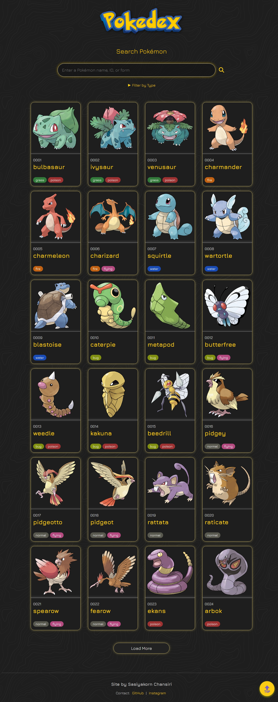
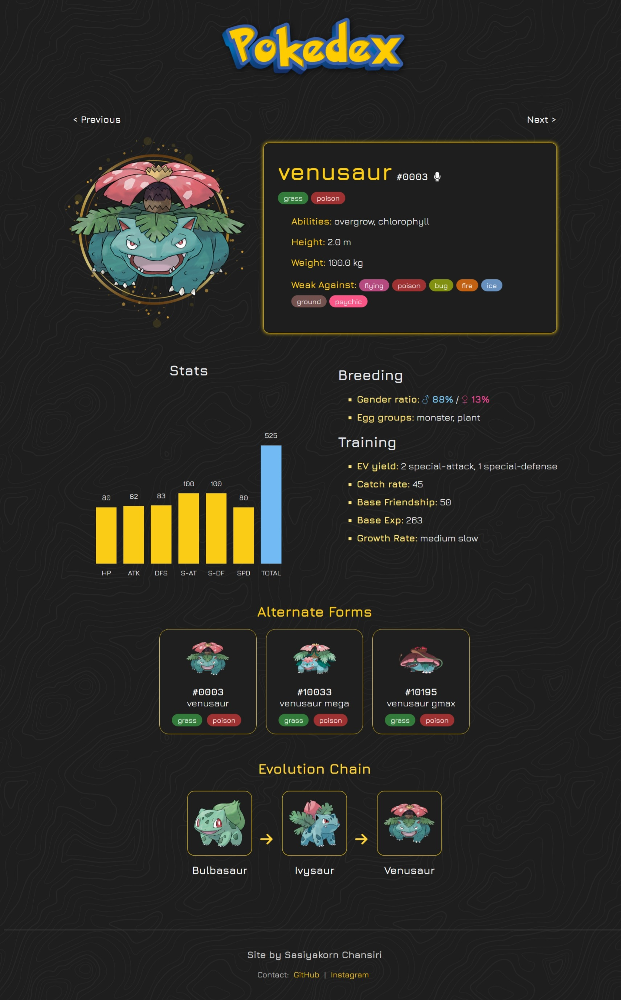

<h1 align="center" style="font-weight: bold;">🌟 Pokedex</h1>

<p align="center">
  A Pokedex built with React, Vite, and PokeAPI.<br/>
  Explore all Pokemon with search, type filters, alternate forms, and detailed stats.
</p>


<h2 id="screenshot">📸 Screenshot</h2>

<table align="center">
  <tr>
    <td align="center" valign="top">
      <div><strong>Home</strong></div>
      
    </td>
    <td align="center" valign="top">
      <div><strong>Pokemon Details</strong></div>
      
    </td>
  </tr>
</table>

<h2 id="features">🔥 Features</h2>
<ul>
  <li>Search Pokemon by name or ID</li>
  <li>Filter by Type (up to 2 types)</li>
  <li>View Stats Chart</li>
  <li>View Alternate Forms</li>
    - Displayed as a slideshow on smaller screens (e.g. mobile and tablets) <br/> 
    - Automatically switches to list view on extremely narrow screens 
  <li>Button to hear Pokemon cry (if available)</li>
  <li>Fallback image support when Pokemon image is missing</li>
  <li>Scroll-to-Top button</li>
  <li>Navigate to the next/previous Pokemon directly from the Pokemon details page</li>
  <li>Responsive layout for mobile, tablet and desktop</li>
</ul>

<h2 id="tech">🛠 Technologies</h2>
<ul>
  <li>React (with Hooks)</li>
  <li>Vite</li>
  <li>CSS</li>
  <li>PokeAPI (<a href="https://pokeapi.co/">https://pokeapi.co</a>)</li>
  <li>Font Awesome for icons</li>
</ul>

<h2 id="getting-started">🚀 Getting Started</h2>

<h3>Prerequisites</h3>
<ul>
  <li><a href="https://nodejs.org">NodeJS</a> (v20.12.2)</li>
  <li><a href="https://git-scm.com">Git</a> (v2.40+)</li>
</ul>

<h3>Clone and Run</h3>

```bash
git clone https://github.com/pingpiing/pokedex.git
cd pokedex
npm install
npm run dev
